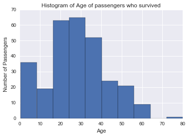
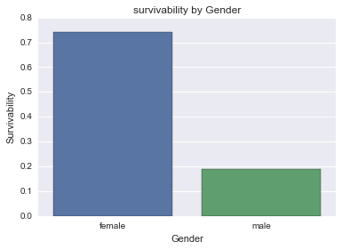
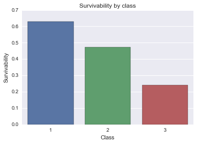
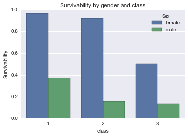
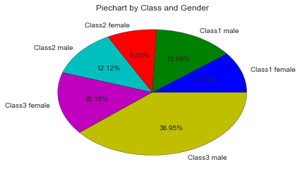
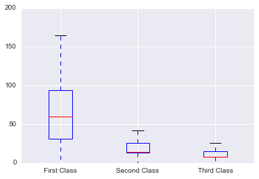

Investigate a Dataset

## Question to answer
- Are children given priority in the rescure?
- What factors made people more likely to survive?
- Do gender, class and age play a role in survivability?
- Is there a relationship between Fare and Pclass

## Load titantic_data.csv using pandas read_csv function.


```python
import pandas as pd
import numpy as np

```


```python
# Read csv file into dataframe using pandas read function
mydata = pd.read_csv('titanic_data.csv')
```


```python
# Quick look into the dataset
mydata.head()
```


<div>
<table border="1" class="dataframe">
  <thead>
    <tr style="text-align: right;">
      <th></th>
      <th>PassengerId</th>
      <th>Survived</th>
      <th>Pclass</th>
      <th>Name</th>
      <th>Sex</th>
      <th>Age</th>
      <th>SibSp</th>
      <th>Parch</th>
      <th>Ticket</th>
      <th>Fare</th>
      <th>Cabin</th>
      <th>Embarked</th>
    </tr>
  </thead>
  <tbody>
    <tr>
      <th>0</th>
      <td>1</td>
      <td>0</td>
      <td>3</td>
      <td>Braund, Mr. Owen Harris</td>
      <td>male</td>
      <td>22.0</td>
      <td>1</td>
      <td>0</td>
      <td>A/5 21171</td>
      <td>7.2500</td>
      <td>NaN</td>
      <td>S</td>
    </tr>
    <tr>
      <th>1</th>
      <td>2</td>
      <td>1</td>
      <td>1</td>
      <td>Cumings, Mrs. John Bradley (Florence Briggs Th...</td>
      <td>female</td>
      <td>38.0</td>
      <td>1</td>
      <td>0</td>
      <td>PC 17599</td>
      <td>71.2833</td>
      <td>C85</td>
      <td>C</td>
    </tr>
    <tr>
      <th>2</th>
      <td>3</td>
      <td>1</td>
      <td>3</td>
      <td>Heikkinen, Miss. Laina</td>
      <td>female</td>
      <td>26.0</td>
      <td>0</td>
      <td>0</td>
      <td>STON/O2. 3101282</td>
      <td>7.9250</td>
      <td>NaN</td>
      <td>S</td>
    </tr>
    <tr>
      <th>3</th>
      <td>4</td>
      <td>1</td>
      <td>1</td>
      <td>Futrelle, Mrs. Jacques Heath (Lily May Peel)</td>
      <td>female</td>
      <td>35.0</td>
      <td>1</td>
      <td>0</td>
      <td>113803</td>
      <td>53.1000</td>
      <td>C123</td>
      <td>S</td>
    </tr>
    <tr>
      <th>4</th>
      <td>5</td>
      <td>0</td>
      <td>3</td>
      <td>Allen, Mr. William Henry</td>
      <td>male</td>
      <td>35.0</td>
      <td>0</td>
      <td>0</td>
      <td>373450</td>
      <td>8.0500</td>
      <td>NaN</td>
      <td>S</td>
    </tr>
  </tbody>
</table>
</div>


```python
# View summary statistics of those who survived
mydata[mydata.Survived == 1].describe()
```


<div>
<table border="1" class="dataframe">
  <thead>
    <tr style="text-align: right;">
      <th></th>
      <th>PassengerId</th>
      <th>Survived</th>
      <th>Pclass</th>
      <th>Age</th>
      <th>SibSp</th>
      <th>Parch</th>
      <th>Fare</th>
    </tr>
  </thead>
  <tbody>
    <tr>
      <th>count</th>
      <td>342.000000</td>
      <td>342.0</td>
      <td>342.000000</td>
      <td>290.000000</td>
      <td>342.000000</td>
      <td>342.000000</td>
      <td>342.000000</td>
    </tr>
    <tr>
      <th>mean</th>
      <td>444.368421</td>
      <td>1.0</td>
      <td>1.950292</td>
      <td>28.343690</td>
      <td>0.473684</td>
      <td>0.464912</td>
      <td>48.395408</td>
    </tr>
    <tr>
      <th>std</th>
      <td>252.358840</td>
      <td>0.0</td>
      <td>0.863321</td>
      <td>14.950952</td>
      <td>0.708688</td>
      <td>0.771712</td>
      <td>66.596998</td>
    </tr>
    <tr>
      <th>min</th>
      <td>2.000000</td>
      <td>1.0</td>
      <td>1.000000</td>
      <td>0.420000</td>
      <td>0.000000</td>
      <td>0.000000</td>
      <td>0.000000</td>
    </tr>
    <tr>
      <th>25%</th>
      <td>250.750000</td>
      <td>1.0</td>
      <td>1.000000</td>
      <td>19.000000</td>
      <td>0.000000</td>
      <td>0.000000</td>
      <td>12.475000</td>
    </tr>
    <tr>
      <th>50%</th>
      <td>439.500000</td>
      <td>1.0</td>
      <td>2.000000</td>
      <td>28.000000</td>
      <td>0.000000</td>
      <td>0.000000</td>
      <td>26.000000</td>
    </tr>
    <tr>
      <th>75%</th>
      <td>651.500000</td>
      <td>1.0</td>
      <td>3.000000</td>
      <td>36.000000</td>
      <td>1.000000</td>
      <td>1.000000</td>
      <td>57.000000</td>
    </tr>
    <tr>
      <th>max</th>
      <td>890.000000</td>
      <td>1.0</td>
      <td>3.000000</td>
      <td>80.000000</td>
      <td>4.000000</td>
      <td>5.000000</td>
      <td>512.329200</td>
    </tr>
  </tbody>
</table>
</div>


```python
# View Summary statistics of those who died
mydata[mydata.Survived == 0].describe()
```


<div>
<table border="1" class="dataframe">
  <thead>
    <tr style="text-align: right;">
      <th></th>
      <th>PassengerId</th>
      <th>Survived</th>
      <th>Pclass</th>
      <th>Age</th>
      <th>SibSp</th>
      <th>Parch</th>
      <th>Fare</th>
    </tr>
  </thead>
  <tbody>
    <tr>
      <th>count</th>
      <td>549.000000</td>
      <td>549.0</td>
      <td>549.000000</td>
      <td>424.000000</td>
      <td>549.000000</td>
      <td>549.000000</td>
      <td>549.000000</td>
    </tr>
    <tr>
      <th>mean</th>
      <td>447.016393</td>
      <td>0.0</td>
      <td>2.531876</td>
      <td>30.626179</td>
      <td>0.553734</td>
      <td>0.329690</td>
      <td>22.117887</td>
    </tr>
    <tr>
      <th>std</th>
      <td>260.640469</td>
      <td>0.0</td>
      <td>0.735805</td>
      <td>14.172110</td>
      <td>1.288399</td>
      <td>0.823166</td>
      <td>31.388207</td>
    </tr>
    <tr>
      <th>min</th>
      <td>1.000000</td>
      <td>0.0</td>
      <td>1.000000</td>
      <td>1.000000</td>
      <td>0.000000</td>
      <td>0.000000</td>
      <td>0.000000</td>
    </tr>
    <tr>
      <th>25%</th>
      <td>211.000000</td>
      <td>0.0</td>
      <td>2.000000</td>
      <td>21.000000</td>
      <td>0.000000</td>
      <td>0.000000</td>
      <td>7.854200</td>
    </tr>
    <tr>
      <th>50%</th>
      <td>455.000000</td>
      <td>0.0</td>
      <td>3.000000</td>
      <td>28.000000</td>
      <td>0.000000</td>
      <td>0.000000</td>
      <td>10.500000</td>
    </tr>
    <tr>
      <th>75%</th>
      <td>675.000000</td>
      <td>0.0</td>
      <td>3.000000</td>
      <td>39.000000</td>
      <td>1.000000</td>
      <td>0.000000</td>
      <td>26.000000</td>
    </tr>
    <tr>
      <th>max</th>
      <td>891.000000</td>
      <td>0.0</td>
      <td>3.000000</td>
      <td>74.000000</td>
      <td>8.000000</td>
      <td>6.000000</td>
      <td>263.000000</td>
    </tr>
  </tbody>
</table>
</div>


```python
# Or similary we can use groupby function to split the group
grouped_survived = mydata.groupby('Survived',as_index=False)
```


```python
grouped_survived.describe()
```


<div>
<table border="1" class="dataframe">
  <thead>
    <tr style="text-align: right;">
      <th></th>
      <th></th>
      <th>PassengerId</th>
      <th>Survived</th>
      <th>Pclass</th>
      <th>Age</th>
      <th>SibSp</th>
      <th>Parch</th>
      <th>Fare</th>
    </tr>
  </thead>
  <tbody>
    <tr>
      <th rowspan="8" valign="top">0</th>
      <th>count</th>
      <td>549.000000</td>
      <td>549.0</td>
      <td>549.000000</td>
      <td>424.000000</td>
      <td>549.000000</td>
      <td>549.000000</td>
      <td>549.000000</td>
    </tr>
    <tr>
      <th>mean</th>
      <td>447.016393</td>
      <td>0.0</td>
      <td>2.531876</td>
      <td>30.626179</td>
      <td>0.553734</td>
      <td>0.329690</td>
      <td>22.117887</td>
    </tr>
    <tr>
      <th>std</th>
      <td>260.640469</td>
      <td>0.0</td>
      <td>0.735805</td>
      <td>14.172110</td>
      <td>1.288399</td>
      <td>0.823166</td>
      <td>31.388207</td>
    </tr>
    <tr>
      <th>min</th>
      <td>1.000000</td>
      <td>0.0</td>
      <td>1.000000</td>
      <td>1.000000</td>
      <td>0.000000</td>
      <td>0.000000</td>
      <td>0.000000</td>
    </tr>
    <tr>
      <th>25%</th>
      <td>211.000000</td>
      <td>0.0</td>
      <td>2.000000</td>
      <td>21.000000</td>
      <td>0.000000</td>
      <td>0.000000</td>
      <td>7.854200</td>
    </tr>
    <tr>
      <th>50%</th>
      <td>455.000000</td>
      <td>0.0</td>
      <td>3.000000</td>
      <td>28.000000</td>
      <td>0.000000</td>
      <td>0.000000</td>
      <td>10.500000</td>
    </tr>
    <tr>
      <th>75%</th>
      <td>675.000000</td>
      <td>0.0</td>
      <td>3.000000</td>
      <td>39.000000</td>
      <td>1.000000</td>
      <td>0.000000</td>
      <td>26.000000</td>
    </tr>
    <tr>
      <th>max</th>
      <td>891.000000</td>
      <td>0.0</td>
      <td>3.000000</td>
      <td>74.000000</td>
      <td>8.000000</td>
      <td>6.000000</td>
      <td>263.000000</td>
    </tr>
    <tr>
      <th rowspan="8" valign="top">1</th>
      <th>count</th>
      <td>342.000000</td>
      <td>342.0</td>
      <td>342.000000</td>
      <td>290.000000</td>
      <td>342.000000</td>
      <td>342.000000</td>
      <td>342.000000</td>
    </tr>
    <tr>
      <th>mean</th>
      <td>444.368421</td>
      <td>1.0</td>
      <td>1.950292</td>
      <td>28.343690</td>
      <td>0.473684</td>
      <td>0.464912</td>
      <td>48.395408</td>
    </tr>
    <tr>
      <th>std</th>
      <td>252.358840</td>
      <td>0.0</td>
      <td>0.863321</td>
      <td>14.950952</td>
      <td>0.708688</td>
      <td>0.771712</td>
      <td>66.596998</td>
    </tr>
    <tr>
      <th>min</th>
      <td>2.000000</td>
      <td>1.0</td>
      <td>1.000000</td>
      <td>0.420000</td>
      <td>0.000000</td>
      <td>0.000000</td>
      <td>0.000000</td>
    </tr>
    <tr>
      <th>25%</th>
      <td>250.750000</td>
      <td>1.0</td>
      <td>1.000000</td>
      <td>19.000000</td>
      <td>0.000000</td>
      <td>0.000000</td>
      <td>12.475000</td>
    </tr>
    <tr>
      <th>50%</th>
      <td>439.500000</td>
      <td>1.0</td>
      <td>2.000000</td>
      <td>28.000000</td>
      <td>0.000000</td>
      <td>0.000000</td>
      <td>26.000000</td>
    </tr>
    <tr>
      <th>75%</th>
      <td>651.500000</td>
      <td>1.0</td>
      <td>3.000000</td>
      <td>36.000000</td>
      <td>1.000000</td>
      <td>1.000000</td>
      <td>57.000000</td>
    </tr>
    <tr>
      <th>max</th>
      <td>890.000000</td>
      <td>1.0</td>
      <td>3.000000</td>
      <td>80.000000</td>
      <td>4.000000</td>
      <td>5.000000</td>
      <td>512.329200</td>
    </tr>
  </tbody>
</table>
</div>


```python
# Load plotting libraries
%pylab inline
import matplotlib.pyplot as plt
import seaborn as sns
```

    Populating the interactive namespace from numpy and matplotlib


```python
survived_age = mydata[mydata.Survived == 1]['Age']
died_age = mydata[mydata.Survived == 0]['Age']

plt.hist(survived_age[~np.isnan(survived_age)],) # numpy function isnan to remove NaN values
plt.xlabel('Age')
plt.ylabel('Number of Passengers')
plt.title('Histogram of Age of passengers who survived')
```


    <matplotlib.text.Text at 0x10cfb4850>





```python
plt.hist(died_age[~np.isnan(died_age)]) # numpy function isnan to remove NaN values
plt.xlabel('Age')
plt.ylabel('Number of Passengers')
plt.title('Histogram of Age of passengers who died')
```


    <matplotlib.text.Text at 0x10d222f50>


## Question: Are children given priority in the rescure?
- From what I see from the two histogram, passengers of young ages are more likely to be saved.


```python
table1 = mydata.groupby('Sex',as_index = False)['Survived'].mean()
print(table)
```

          Sex  Survived
    0  female  0.742038
    1    male  0.188908


```python
sns.barplot(data = table1, x='Sex', y = 'Survived').set(title = 'survivability by Gender', xlabel = 'Gender', ylabel = 'Survivability')
```


    [<matplotlib.text.Text at 0x10f264ad0>,
     <matplotlib.text.Text at 0x10f0f0050>,
     <matplotlib.text.Text at 0x10f238d90>]





```python
table2 = mydata.groupby('Pclass',as_index = False)['Survived'].mean()
print(table)
```

          Sex  Survived
    0  female  0.742038
    1    male  0.188908


```python
sns.barplot(data = table2, x='Pclass', y='Survived').set(title = 'Survivability by class', xlabel = 'Class', ylabel = 'Survivability')
```


    [<matplotlib.text.Text at 0x10f6f7950>,
     <matplotlib.text.Text at 0x10f44e910>,
     <matplotlib.text.Text at 0x10f722ed0>]





```python
table3 = mydata.groupby(['Pclass','Sex'], as_index =False)['Survived'].mean()
```


```python
sns.barplot(data = table3,x='Pclass',y = 'Survived', hue = 'Sex').set(title = "Survivability by gender and class",xlabel
                                                                    = 'class',ylabel = "Survivability")

```


    [<matplotlib.text.Text at 0x10f654c50>,
     <matplotlib.text.Text at 0x10f5d3dd0>,
     <matplotlib.text.Text at 0x10f8bfe90>]





```python
print(table4)
```

       Pclass     Sex  PassengerId
    0       1  female           94
    1       1    male          122
    2       2  female           76
    3       2    male          108
    4       3  female          144
    5       3    male          347


```python
table4 = mydata.groupby(['Pclass','Sex'], as_index =False)['PassengerId'].count()
length = len(mydata)
print(table4['PassengerId']/length)
table5 = table4['PassengerId']/length
l = []
for i in range(len(table4)):
    l.append('Class'+str(table4['Pclass'][i])+" "+str(table4['Sex'][i]))
    
plt.pie(table4['PassengerId']/length,labels=l,autopct = '%.2f%%')
plt.title('Piechart by Class and Gender')
```

    0    0.105499
    1    0.136925
    2    0.085297
    3    0.121212
    4    0.161616
    5    0.389450
    Name: PassengerId, dtype: float64


    <matplotlib.text.Text at 0x110179bd0>





## Question: What factors made people more likely to survive?
- Being a first class passenger gives you greater chance of survival.
- Being a female on the ship gives you the greatest possibility of surviving from this accident.
- A female first class passenger has almost 100% survivial rate.


```python
class1fare = mydata[mydata.Pclass == 1]['Fare']
class2fare = mydata[mydata.Pclass == 2]['Fare']
class3fare = mydata[mydata.Pclass == 3]['Fare']
```


```python
plt.boxplot([class1fare,class2fare,class3fare])
plt.xticks([1, 2, 3], ['First Class', 'Second Class', 'Third Class'])
axes = plt.gca()
axes.set_ylim([0,200])
```


    (0, 200)





Question: Is there a relationship between Fare and Pclass
- It seems that a lot of first class passengers pay much primium prices on the tickets
- Second class passengers pay more than third class passengers

## Limitation
- Without the use of statitstical testing, we are unable to draw any concrete conclusions.
- NaNs are simply removed in this excercise. We can look deeper into correlation between missing values and survival rate.
- Occupation or social status and race variables might help in understanding survivability.


```python

```
